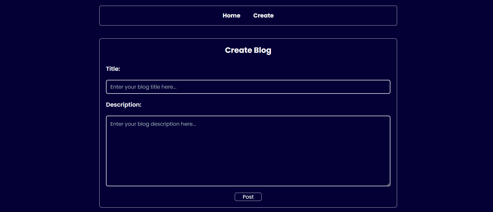
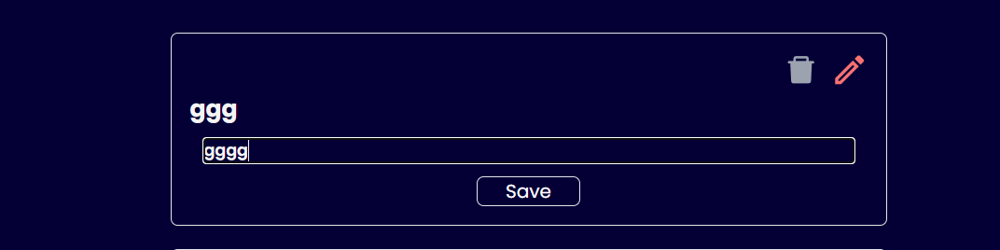

# Blog App

A simple and elegant blog application where users can create, edit, and delete blog posts. This project is built with [your stack here, e.g., Node.js, Express, MongoDB, etc.] and offers a user-friendly interface for managing blogs.

## Table of Contents

- [Features](#features)
- [Screenshots](#screenshots)
- [Installation](#installation)
- [Usage](#usage)
- [Technologies Used](#technologies-used)
- [Contributing](#contributing)
- [License](#license)

## Features

- **Create Blog Posts**: Users can create new blog posts with titles, content, and optional images.
- **Edit Blog Posts**: Users can edit existing posts and update content or images.
- **Delete Blog Posts**: Users have the option to delete posts they no longer want to keep.
- **View All Blogs**: Browse all published blogs with pagination.
- **User Authentication**: Secure login and registration system for creating and managing blog content.
- **Search**: Easily search for blogs by title or content keywords.
- **Responsive Design**: Fully responsive UI that looks great on all devices.

## Screenshots

### Home Page


### Create Blog Post



### Edit Blog Post


> You can find all screenshots in the `screenshots` folder in the repository.

## Installation

1. Clone the repository:

    ```bash
    git clone https://github.com/vjymisal0/blogapp.git
    ```

2. Navigate to the two different directories for frontend and backend:

    ```bash
    cd client
    ```

    ```bash
    cd server
    ```

3. Install dependencies in both the terminals:

    ```bash
    npm install
    ```   

4. Start the development server:

    ```bash
    npm start or npm run dev
    ```

5. Open your browser and navigate to `http://localhost:3000` for backend & "http://localhost:5050" for frontend to view the app.

## Usage

- **Creating a Blog**: After signing up or logging in, click on the "New Post" button on the homepage to create a new blog post.
- **Editing a Blog**: You can edit any blog post by going to the blog detail page and clicking the "Edit" button.
- **Deleting a Blog**: On the blog detail page, you'll also have the option to delete the blog post.

## Technologies Used

- **Frontend**: HTML5, CSS3, JavaScript, [React.js or other framework/library]
- **Backend**: Node.js, Express
- **Database**: MongoDB
- **Styling**: [Tailwind CSS / Bootstrap / Custom CSS]
- **Deployment**: [Vercel / Netlify]

## Contributing

Contributions are welcome! If you'd like to improve this project, feel free to fork the repository and submit a pull request.

1. Fork the repository
2. Create a new branch (`git checkout -b feature-branch`)
3. Make your changes
4. Commit your changes (`git commit -m 'Add new feature'`)
5. Push to the branch (`git push origin feature-branch`)
6. Open a pull request

## License

This project is licensed under the MIT License - see the [LICENSE](./LICENSE) file for details.

---

Feel free to create issues if you encounter any bugs or have feature requests!
